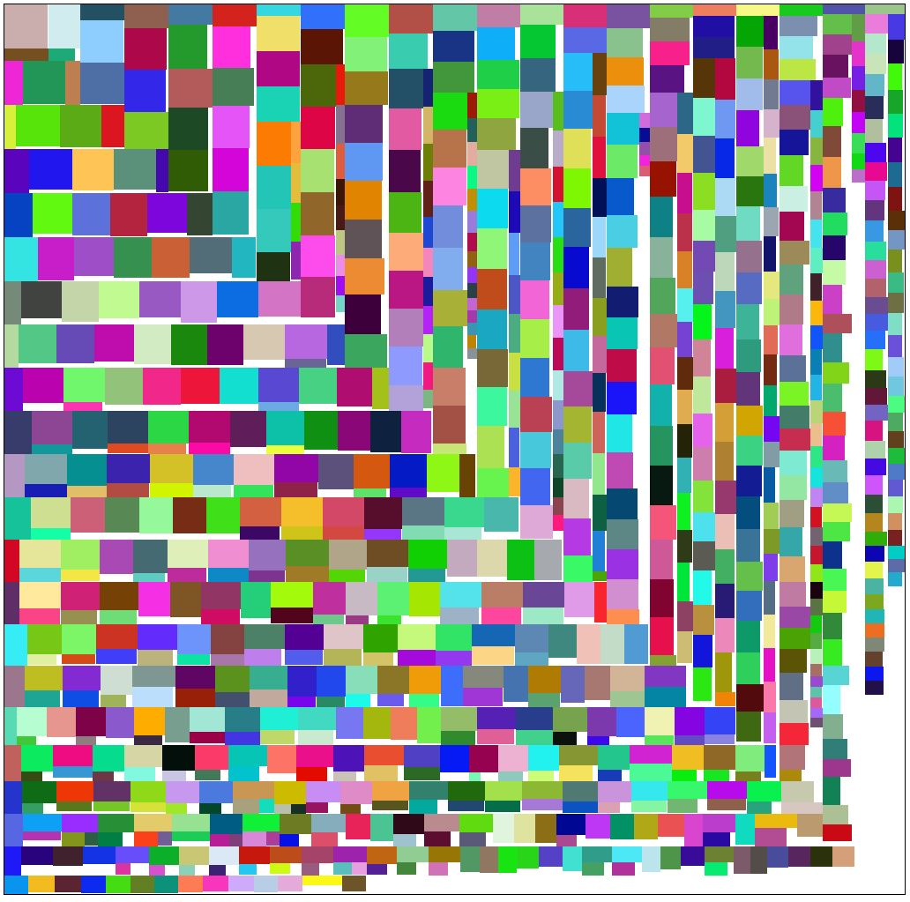

# Simple image/box packer
A lightweight function that takes a set of dimensions and packs them as best it can producing a list of positions. Useful if you want to perform your own rendering via WebGL/Canvas etc.

## Features
- Fast (can pack 1000 boxes of variable dimensions in ~20ms on an i7-2600)
- No dependencies, very small footprint (~3KB minified)
- Generated atlas designed to be as square as possible
- Typescript definitions provided



## How to use

```typescript

import { createAtlas } from 'apl-image-packer';

interface customObj {
  width: number;
  height: number;
  name: string;
}

const atlas = createAtlas<customObj>([
  {
    width: 100,
    height: 200,
    name: 'one'
  },
  {
    width: 450,
    height: 300,
    name: 'two'
  }
]);

/* atlas contains:
{
  coords: [
    {
      //the coordinates for the box
      x: 120,
      y: 140,
      
      //the original object provided (can contain more properties if needed)
      img: {
        width: 100,
        height: 200
      }
    },
    ...
  ],
  //the dimensions of the containing box
  width: 550,
  height: 456
}
*/

```

## Using in node
Install via `npm install apl-image-packer`, then import via ES6 Modules:
```typescript
import { createAtlas } from 'apl-image-packer';
```

## Using in the browser
Add the script tag below or download it an bundle it with your own scripts.
```html
<script src="http://unpkg.com/apl-image-packer/lib/apl-image-packer.min.js"></script>
```

## API

### Interfaces

#### ImagePackerDimension
An object that should be provided to specify the dimensions of the box you want to pack. Other properties can and should be used, i.e. the src to the image

| Name | Type | Description |
|---|---|---|
| width | number | The width of the image |
| height | number | The height of the image |

#### ImagePackerAtlas
Contains the list of coordinates and result dimensions of the atlas.

| Name | Type | Description |
|---|---|---|
| coords | Array\<IImagePackerCoord> | List of coordinates for the boxes in the atlas (not same order as original list) |
| width | number | The width of the atlas |
| height | number | The height of the atlas |

#### ImagePackerCoord
Links back to the dimension object provided, defines the x and y position to insert the box into the atlas.

| Name | Type | Description |
|---|---|---|
| x | number | The x position to insert into the atlas (from the left) |
| y | number | The y position to insert into the atlas (from the top) |
| img | ImagePackerDimension | The original object that was given with the dimensions (can contain more properties) |

### Classes

#### ImagePacker
The main class used to create the atlas

| Method | Description | Paramaters | Return Type |
|---|---|---|---|
| createAtlas | Creates the atlas from the provided list of dimensions | imgs: Array\<ImagePackerDimension\> | atlas: ImagePackerAtlas |

## Licence
All code is licenced under MIT.
